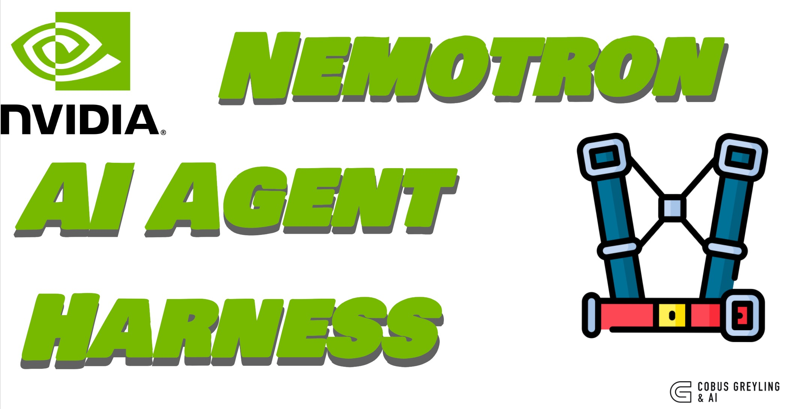

<p align="center">
  
</p>

# Nemotron Harness

Runtime orchestration framework for **NVIDIA Nemotron 3 Nano Omni** (30B-A3B) — the single model that processes text, images, audio, and video natively.

The model is a stateless function call. The harness is everything that makes it work: context management, safety enforcement, tool dispatch, and modality-aware inference.

```
  ┌──────────────────────────────────────────────────────────────┐
  │                    User Input                                │
  │  Text / Audio / Video / Image                                │
  └──────────────────────────┬───────────��───────────────────────┘
                             │
                             ▼
  ┌─���───────────────────���────────────────────────────────────────┐
  │                   Nemotron Harness                           │
  │                                                              │
  │  ┌─────────────┐  ┌────��─────────┐  ┌───────────────────┐   │
  │  │  Compaction  │  │  Doom-Loop   │  │  System Reminder  ��   │
  │  │  (5-stage)   │  │  Detection   │  │  Injection        │   │
  │  └──────┬───────┘  └──────┬───────┘  └────────┬──────────┘   │
  │         │                 │                    │              │
  │         └─────────────────┼────────────────────┘              │
  │                           │                                  │
  │              ┌────────────▼────────────┐                     │
  │              │   Nemotron 3 Nano Omni  │                     │
  │              │   (modality-aware call) │                     │
  │              └────────────┬─��──────────┘                     │
  │                           │                                  │
  │              ┌���───────────▼────────────┐                     │
  │              │    Tool Registry        │                     │
  │              │    (execute + feed back)│                     │
  │              └────────────┬────────────┘                     │
  │                           │                                  │
  │              ┌────────────▼────────────┐                     │
  │              │  Completion Checker     │                     │
  │              │  (premature exit guard) │                     │
  │              └──────��──────────────────┘                     │
  │                                                              │
  └──��───────────────────────┬─��───────────────────────────────���─┘
                             │
                             ▼
                   ┌────────────────────┐
                   │  Structured Output │
                   └─────���──────────────┘
```

## Quick Start

```bash
# Clone the repo
git clone https://github.com/cobusgreyling/nemotron-harness.git
cd nemotron-harness

# Install dependencies
pip install -r requirements.txt

# Set your NVIDIA API key
export NVIDIA_API_KEY="nvapi-your-key-here"

# Run an example
python examples/01_meeting_agent/meeting_agent.py
python examples/02_document_analyst/document_analyst.py
python examples/03_voice_assistant/voice_assistant.py --demo
```

## What the Harness Does

The model generates text. The harness does everything else:

| Component | What It Does | Why |
|-----------|-------------|-----|
| **ReAct Loop** | Multi-turn tool calling with automatic result feeding | The model can't call tools on its own |
| **Context Compaction** | 5-stage progressive compression as context fills | The model doesn't manage its own window |
| **Doom-Loop Detection** | Fingerprint identical tool calls, warn then halt | The model can't detect its own loops |
| **System Reminders** | Re-inject instructions every N rounds | The model loses attention to distant prompts |
| **Completion Checking** | Detect premature "I'm done" signals | The model stops before the job is finished |
| **Modality Config** | Auto-set thinking/temperature per modality | Audio/video require specific settings |

## Harness Architecture

```
nemotron-harness/
├── nemotron_harness/
│   ├── __init__.py          # Public API
│   ├── client.py            # NVIDIA NIM client setup
│   ├── stream.py            # Streaming consumer + accumulator
���   ├── harness.py           # Core ReAct loop with all harness patterns
│   ├── tools.py             # Generic tool registry + execution
│   ├── compaction.py        # 5-stage adaptive context compaction
│   ���── reminders.py         # System reminder injection
│   ├── modalities/
│   │   ├── audio.py         # Audio encoding (wav, mp3, ogg, flac, m4a)
│   │   ├── video.py         # Video encoding (mp4, mov, avi, webm)
│   │   └── image.py         # Image encoding (jpg, png, webp, etc.)
│   └── safety/
│       ├── doom_loop.py     # Fingerprint-based loop detection
│       └── completion.py    # Premature completion detection
├── examples/
│   ├── 01_meeting_agent/    # Meeting intelligence extraction
│   ├── 02_document_analyst/ # Document/report analysis
│   └── 03_voice_assistant/  # Audio conversation processing
├── requirements.txt
├── LICENSE
└── .env.example
```

## Usage

### Basic: Text input with tools

```python
from nemotron_harness import NemotronHarness, ToolRegistry

# Define your tools
tools = ToolRegistry()

@tools.register(
    name="search",
    description="Search for information.",
    parameters={
        "type": "object",
        "properties": {
            "query": {"type": "string", "description": "Search query"},
        },
        "required": ["query"],
    },
)
def search(query: str) -> str:
    return f"Results for: {query}"

# Create the harness
harness = NemotronHarness(
    tools=tools,
    system_prompt="You are a helpful assistant. Use tools when needed.",
)

# Run it
result = harness.run("What's the weather in Cape Town?")
print(result.content)
print(f"Tool calls made: {result.tool_calls_total}")
```

### Audio input

```python
from nemotron_harness import NemotronHarness, ToolRegistry
from nemotron_harness.modalities import build_audio_message

harness = NemotronHarness(tools=tools, system_prompt="Transcribe and analyse.")

message = build_audio_message("meeting.wav", prompt="Analyse this recording.")
result = harness.run(message, modality="audio")
```

### Image input

```python
from nemotron_harness.modalities import build_image_message

message = build_image_message("slide.png", prompt="Summarise this slide.")
result = harness.run(message, modality="image")
```

### Video input

```python
from nemotron_harness.modalities import build_video_message

message, extra = build_video_message("demo.mp4", prompt="Analyse this video.")
result = harness.run(message, modality="video", extra_body=extra)
```

## Modality Constraints

Nemotron 3 Nano Omni has specific inference requirements per modality:

```
Modality     enable_thinking    temperature    Notes
────��────────────────────────────────────────────────────────
Text         true / false       0.6            Reasoning budget optional
Image        true / false       0.6            Full reasoning supported
Audio        false (required)   0 (required)   No reasoning on audio
Video        false (required)   0 (required)   use_audio_in_video flag
Tool call    true / false       0.6            Works with all modalities
─────────���────────────────────────────���──────────────────────
```

The harness enforces these automatically via the `modality` parameter.

## The Five Compaction Stages

When context pressure builds, the harness applies progressively aggressive compaction:

| Stage | Name | Threshold | What It Does |
|-------|------|-----------|-------------|
| 1 | Trim | 50% | Strip reasoning traces from older turns |
| 2 | Summarise | 65% | Replace older tool results with one-line summaries |
| 3 | Collapse | 80% | Merge older assistant+tool rounds into summaries |
| 4 | Prune | 90% | Drop oldest turns entirely |
| 5 | Reset | 95% | Keep only system prompt + reset notice |

## Model

**NVIDIA Nemotron 3 Nano Omni** — 30B parameters total, 3B active per inference (Mixture-of-Experts). Processes text, images, audio, and video natively in a single model. OpenAI-compatible API via NVIDIA NIM.

Model ID: `private/nvidia/nemotron-3-nano-omni-reasoning-30b-a3b`

## Author

Cobus Greyling

## License

MIT
